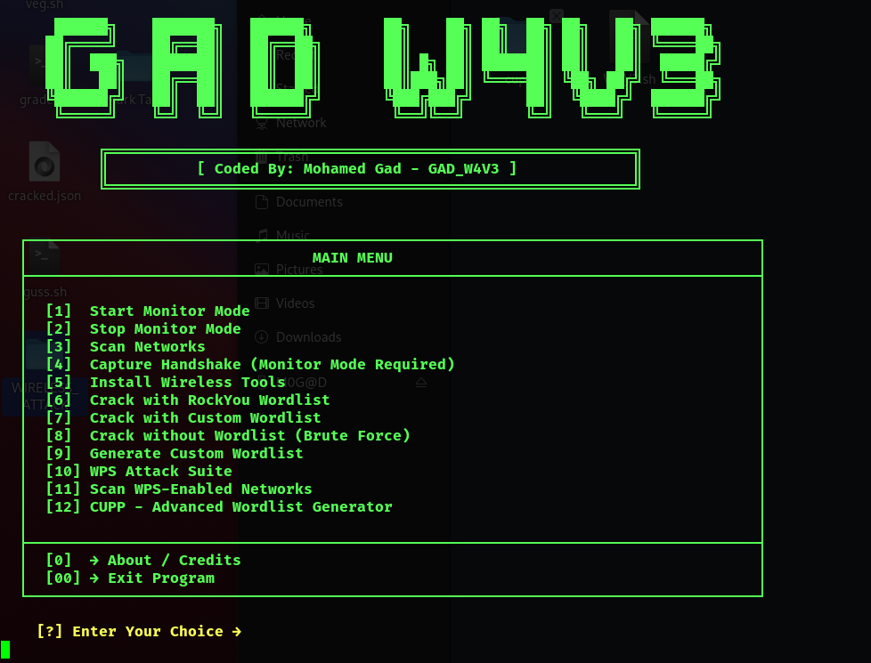

# ⚡ W4V3 — Wireless Attack Toolkit


---

## 🧠 Overview  
**W4V3** is an advanced Bash-based toolkit that combines multiple wireless and Bluetooth attack tools in one interactive terminal menu.  
It helps you **scan, capture, crack, and exploit** wireless networks or devices — and can also **install all needed tools automatically** from inside the menu.  

Perfect for pentesters who want everything in one place.  

---

## 🚀 Features  
- Start / Stop monitor mode  
- Scan for nearby Wi-Fi networks  
- Capture WPA/WPA2 handshakes  
- Crack passwords using `rockyou.txt` or custom wordlists  
- Generate your own wordlists with `crunch`  
- WPS attacks using `Reaver`, `Bully`, and `PixieWPS`  
- Install any wireless or Bluetooth hacking tools directly from inside the menu  
- Fully interactive and beginner-friendly  

---

## 💻 Installation  
```bash
git clone https://github.com/mogad77/GAD_W4V3.git
cd W4V3
chmod +x W4V3.sh
sudo ./W4V3.sh
